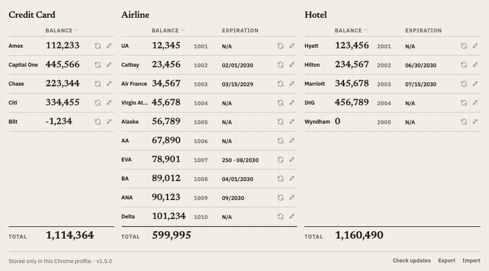

# Points Tracker

A local-only Chrome extension for viewing airline, hotel, and credit-card rewards balances in one compact three-column popup, with loyalty member numbers and expiration information where applicable. It supports United MileagePlus, Cathay Asia Miles, Air France Flying Blue, Virgin Atlantic Flying Club, Alaska Airlines Atmos Rewards, American AAdvantage, EVA Air Infinity MileageLands, British Airways Club, ANA Mileage Club, Delta SkyMiles, World of Hyatt, Hilton Honors, Marriott Bonvoy, IHG One Rewards, Wyndham Rewards, American Express Membership Rewards, Capital One Miles, Chase Ultimate Rewards, Citi ThankYou Rewards, and Bilt Rewards.

The extension never asks for or stores usernames, passwords, cookies, authentication tokens, member names, card details, per-card balances, or transaction history. It stores only the displayed loyalty member number when applicable and the program-level ledger values, plus a non-personal update-check timestamp and latest public release version, in the current Chrome profile.

## Preview



_All balances, member numbers, and expiration dates shown above are fictional demo data._

## Install in Chrome — no coding required

1. [Download the ready-to-install ZIP](https://github.com/itswcl/PointsTracker/releases/latest/download/points-tracker-chrome.zip).
2. Open your **Downloads** folder and double-click the ZIP to unzip it.
3. In Chrome, open `chrome://extensions`.
4. Turn on **Developer mode** in the upper-right corner.
5. Select **Load unpacked**, then choose the unzipped `points-tracker-chrome` folder.
6. Select Chrome's puzzle-piece **Extensions** button and pin **Points Tracker**.

Keep the unzipped folder on your computer after installation. Chrome uses the files in that folder to run the extension.

See the [beginner installation guide](./docs/INSTALLATION.md) for pictures-in-words directions, first use, updates, and troubleshooting.

## Independent project

Points Tracker is an independent project and is not affiliated with or endorsed by any supported airline, hotel, card issuer, or loyalty program. All company and program names and marks belong to their respective owners and are used only to identify the programs supported by the extension.

## Development

Requirements: Node.js 22 or newer and Chrome.

The codebase uses strict TypeScript across the extension runtime, React popup, adapters, Chrome messaging and storage, build configuration, and tests. Shared domain contracts live in `src/types.ts`.

```bash
npm install
npm run dev
```

For a production build:

```bash
npm run check
```

`npm run check` runs strict TypeScript validation, ESLint, the full Vitest suite, and the production extension build. Run only the compiler with `npm run typecheck`.

Load `dist` from `chrome://extensions` with Developer mode enabled.

Detailed setup and usage are in [docs/INSTALLATION.md](./docs/INSTALLATION.md).

The program-name and original-artwork boundary is documented in [docs/BRAND_ASSETS.md](./docs/BRAND_ASSETS.md).

The Chrome toolbar uses the bundled Point Ledger icon from `assets/icons` instead of Chrome's generated letter placeholder.

See [MVP_DESIGN.md](./MVP_DESIGN.md) for the approved design and [IMPLEMENTATION_PLAN.md](./IMPLEMENTATION_PLAN.md) for the delivery sequence.

Chrome Web Store and public-repository readiness are tracked in [docs/CHROME_WEB_STORE_CHECKLIST.md](./docs/CHROME_WEB_STORE_CHECKLIST.md). Draft store-listing copy is in [docs/STORE_LISTING_DRAFT.md](./docs/STORE_LISTING_DRAFT.md).

Release history is recorded in [CHANGELOG.md](./CHANGELOG.md).

## Privacy boundary

- Exact host access only for United, Cathay, Air France, Virgin Atlantic, Alaska Airlines, American Airlines, EVA Air, British Airways, ANA, Delta, Hyatt, Hilton, Marriott, IHG, Wyndham, Amex, Capital One, Chase, Citi, Bilt, and GitHub's public release API
- No cookie, password, history, or network interception permissions
- No backend, analytics, or data uploads
- No raw account-page HTML stored
- Anonymous GitHub release check no more than once every 24 hours; no loyalty data is included
- Plain local JSON backup contains member numbers, balances, and dates

## Implementation status

- Version 1.2.0 adds locally stored Member # capture for all thirteen programs, same-tab secondary-page capture for Flying Blue, British Airways, and ANA, Delta SkyMiles support, interrupted-refresh recovery, and a slightly larger compact popup.
- Version 1.2.1 adds the installed extension version to the footer and provides a permission-free **Check updates** link to the latest GitHub release.
- Version 1.3.0 checks GitHub's public latest-release endpoint no more than once every 24 hours and shows a compact update banner only when a newer version is available.
- Version 1.4.0 adds IHG, Wyndham, Amex, Chase, Citi, and Bilt; introduces the Credit Card ledger; improves sign-in waiting and member-number copying; and fixes Chase multi-card totals and compact-popup overflow.
- Version 1.5.0 adds Capital One Miles as a balance-only Credit Card program using the exact rendered `Miles` total while excluding Rewards cash and card details.
- React popup, local records, separate airline, hotel, and Credit Card balance totals, manual overrides, import/export, capture coordination, and privacy safeguards are implemented.
- All twenty program adapters have tested parser contracts.
- Production member-number sources have been confirmed for all fifteen airline and hotel programs. Flying Blue, British Airways, and ANA use one extension-owned tab in sequence because their member numbers appear on a different official account page from the balance or expiration details.
- United's My United account URL and production balance selector are confirmed.
- Cathay's authenticated account URL and production selectors are confirmed; remaining rebuilt-extension checks are tracked in [docs/LIVE_ACCEPTANCE.md](./docs/LIVE_ACCEPTANCE.md).
- Air France Flying Blue's authenticated miles-overview data and membership-card number are confirmed.
- Virgin Atlantic Flying Club's logged-in account-overview balance and member-number selectors are confirmed.
- Alaska Airlines' logged-in homepage balance path is confirmed.
- American AAdvantage's account-summary balance and expiration-message selectors are confirmed.
- EVA Air's self-award balance and expiring-mileage table structure are confirmed.
- British Airways' Avios balance and newest statement-month structure are confirmed.
- ANA's total-mileage definition list and latest-activity expiry column are confirmed.
- Delta SkyMiles' overview balance selector is confirmed; SkyMiles display expiration as `N/A`.
- World of Hyatt's `Current Point Balance` layout is confirmed; this personal cardholder profile is configured to display expiration as `N/A`.
- Hilton Honors' account summary fields `totalPointsFmt` and `pointsExpiration` are confirmed; the visible `honorsPointsBlock` and 24-month inactivity policy remain fallbacks.
- Marriott Bonvoy's member-status balance and `All Qualifying` activity filter are confirmed; expiration is derived by adding 24 months to the newest qualifying activity, while Lifetime Elite displays `N/A`.
- IHG One Rewards' rendered balance, member number, and Elite-tier marker are confirmed; expiration displays `N/A` only for an active Silver, Gold, Platinum, or Diamond Elite profile.
- Wyndham Rewards' rendered balance, member number, and no-recent-activity state are confirmed. Zero points plus the exact empty state displays `N/A`; a positive balance retains the 18-month inactivity rule and separate four-year per-point note.
- Amex reads the rendered `Available Points` total for Membership Rewards.
- Capital One reads only the rendered whole-number balance paired with the exact `Miles` label on the authenticated account-summary page.
- Chase sums every rendered card balance on the Ultimate Rewards account-selector page and stores only the combined program total.
- Citi reads the rendered `Total ThankYou® Points` value from the signed-in dashboard.
- Bilt reads the exact signed whole-number balance from the `Your Points` menu; the Credit Card category supports a negative program balance without relaxing airline or hotel validation.
- When refresh reaches a signed-out page, the extension brings that tab forward immediately and keeps watching for up to three minutes so the user can sign in or complete ordinary login steps.
- Manual entry remains the fallback if a supported website changes.

## License

Points Tracker is available under the [MIT License](./LICENSE).
